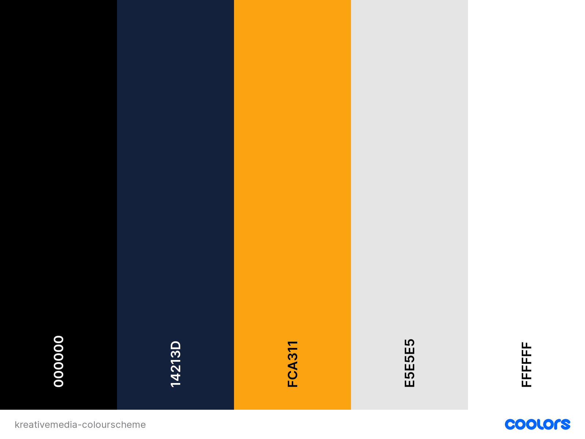

# KreativeMedia - Photography & Content Creation Website

# Introduction

Project milestone 1 for Code Institute Full-stack development program: HTML/CSS Essentials

This is a Front End Website for my business in sports photography and social media content creation, called KreativeMedia. It's a website built to showcase my portfolio of work and attract new clients. (these are all my own images, so therefore do not need any credits). This website is built on four pages, a home, an about page, a work page and a contact page. Along the footer you will find links to contact via mobile/email and social media. It is built only using HTML and CSS languages as per project guidelines.

## Table of Contents

* [Introduction](#introduction)
* [User Experience - UX Design Process](#user-experience---ux-design-process)
    * [Users](#users)
    * [Analysis - User Needs](#analysis---what-are-the-users-needs)
* [Design](#design)
    * [Website Structure](#website-structure)
    * [Color Scheme](#colour-scheme-of-the-website)
    * [Typography](#typography)
    * [Imagery](#imagery)
    * [Videos](#videos)
    * [Google Maps](#google-maps)
    * [Interactive Links](#interactive-links)
* [Features](#features)
    * [Home Page](#home-page)
    * [Navigation Menu](#navigation-menu)
    * [Home Page Header](#home-page-header)
    * [About Section](#about-section)
    * [Video Section](#video-section)
    * [Client Section](#client-section)
    * [Home Page Gallery](#home-page-gallery)
    * [Footer Section](#footer-section)

## User Experience - UX Design Process
### Users
* Commercial Brands (Sport or Other)
* Local Businesses (Running Shops/Triathlon Shops/Sportswear companies)
* Sports Clubs (that may need photography for their event)
* Professional Athletes - looking for brand/product shots
* Other agencies that may require photography or video work 

### Analysis - What are the User's Needs?
* The users have been identified in the area of sport/commercial. They require product shots, event photography/videography, social media content creation, athlete/brand promotion, etc.  
* Social Media is growing quicker than most of us can comprehend. More and more brands/athletes/sports clubs/companies, etc. are utilising social media. 
* In order for a company/brand/athlete to gather a large following, and therefore sell more products/membership/get more entries to their events, etc. their content needs to be engaging and Professional.
* KreativeMedia is there to provide a solution in offering professional photography, videography and social media content creation for these users. 

### Design 
#### Website Structure
* KreativeMedia is a four page website consisting of the Home page, About page, Work page, and a contact form page. The Home page has four sections, an introduction (photo of the photographer and a small blurb) this section includes a button which will take the user to a page that includes more about me and the work that I do, a small list of some of the clients I've worked with in the past (client-info), a selection of my work (photography) this section also includes a button which will take the user to view the rest of my portfolio, the final section is a footer which includes contact details, and links to my social media. The Work page includes more of my work in photography and videography. The About Page includes four sections, a banner image, a section on services I offer, a grid on how the process works from ideation to creation to launch and a footer. The contact page has the nav bar at the top and the contact form, plus the footer that is standard across all pages. The navbar is also standard across all pages. 

### Colour Scheme of the Website
 

 
These colours were choosen using the website [Coolors](https://coolors.co/) which allow you to view trending colour palettes across the web, it's also a useful tool to view your colour palette and how it will look on a webpage!

### Typography
I wanted a clean minimalist typography for the website, so I imported 'Lato' from Google fonts in various weights, the sans-serif is used as a backup.

### Imagery
*The imagery used on this website is from my own personal bank of content that I have taken. If required I will use [Pixabay](https://pixabay.com/) to get royalty free imagery, but at this time there is no requirement. 
* The images are housed on Cloudinary. Cloudinary provides a secure and comprehensive API for easily uploading media files from server-side code, directly from the browser or from a mobile application. 
* I added 'loading=lazy' to the images as with lazy loading, a webpage starts off smaller than its full size and thus loads faster. Speedy web performance has numerous benefits, including better SEO, higher conversion rates, and an improved user experience.
* Please note the images were sized down for online use. 

### Videos
* I wanted to include videos on my website but found it very difficult to ensure they were responsive on all devices without uploading the video into the website itself. I know it's better hosted online somewhere as it reduces the memory and will also help with speed. This led me to do a lot of research on [StackOverflow](https://stackoverflow.com/) which then led me to this responsive iframes article build through CSS which guided me through the process of making my videos responsive on all devices, credit Ben Marshall [Ben Marshall Responsive iframes](https://benmarshall.me/responsive-iframes/).
* I also created a flexbox responsive video gallery on the work page that shows my social media/IG reels that have been created for certain brands. You can see the codepen here [Kieran Jackson Codepen](https://codepen.io/Kieran-Jackson/pen/eYXBVqa)

### Google Maps
*This website has a Google Maps location so users can locate my office/studio if needed. 

### Interactive Links
*At the bottom of the Landing Page and footer, users can access the company social media links (Facebook and Instagram). Users can also click on the mobile phone which will allow them to ring. They can also click the email which will bring up their email application. Once these icons are clicked they all open in a new tab.

## Features
### Home Page
* This is the first page a user will see if they click the main url to view my site. This page was created to be very visual but also to give small snippets about the photographer so that they can read and eventually go on to explore the rest of the website.

### Navigation Menu
#### Desktop 
 

#### Mobile Menu Closed
 

#### Mobile Menu Open

#### Mobile Menu 
 

* At the top of the website, users can find a fixed navigation menu that is fully responsive in all devices. In this navigation menu users can navigate to the different pages in the website. The KreativeMedia logo is also visible on all devices.

## Home Page Header
* This section of the website users can see a sporting photography image as a background followed by a short bio about the photographer. This is giving the users some info on the photogreapher while also sharing some work.
 

## About Section
This section is small, it is about the photographer and a button links to view more about his work experience. 

* Mobile view
 

* Desktop view
 

 

## Video Section
This section showcases another strand of the companies work. Allowing the user to see that the company does more than just imagery. A video that is embedded via YouTube, again focusing on keeping space on the website and ensuring speed is top priority. 
 

 

## Client Section
* This is something that is scalable, built on flexbox it allows for more clients to be added as time goes on. This showcases the clients the company has worked with so the users can start to build a certain level of trust with the photographer. 
* Desktop View
 

 
* Mobile View
 

## Home page Gallery
* This is a small gallery showcasing the company/photographer's work. It is there to provide a taste of what can be done at a sporting event, or other. The images are housed on Cloudinary, freeing up some space on the website. Lazy loading is applied to ensure speed is priority. The images are also resized down from their original. The gallery is build on flexbox and is fully responsive. 
* Desktop View
 

* Mobile View 
 

## Footer Section
* Users can see information about the company's address, a small motto/vision, how to contact the company and links to social media profiles. This is responsive on all devices.
*Desktop View
 

* Mobile View
 

# Work Page
* Nav bar remains consistent across all pages.
## Work Banner
* Desktop

* Mobile

## Work Video Section
* This is a responsive web layout designed using flexbox of some mobile/TikTok style videos that were created by me for brands/clients. The users can view these images on mobile/desktop and it will hopefully give them a sense of how creative/good I am at creating video/moving content.
* Desktop

* Mobile 
 

# About Me Page
## Design
* This page follows are very different design, it's not full of imagery. It's more minimalist and is there to give the user more information on the person/photographer/company. It includes more text, a bio, and portrait of the photographer similar to the homepage. If creating this further I would add more of my own style to it, use my own language, make it a little bit more fun. Add things like where I'm from, what I did growing up, if I was into sport or not etc. A personal CV. But, for the purpose of this project I was maxmising my time spent writing and more time spent designing writing the code. 
* Desktop View

* Mobile View

* The page consists of a few more CTA buttons, which are designed consistently across the website and take the user to the contact me page.

# Contact Me Page

# Technologies Used

# Testing

# Functionality

## Deployment of This Project

The website development was created in the "main" branch. This branch was deployed using GitHub Pages.

* This site was deployed by completing the following steps:

1. Open [GitHub](https://github.com/).
2. Click on the project to be deployed.
3. Navigate to the "Settings".
4. Navigate down to the "GitHub Pages".
5. Click on "Check it out here!".
6. Select the "main" branch and select "Save".
7. The link to the live website was ready on the top.

## Forking This Project

* Fork this project following the steps:

1. Open [GitHub](https://github.com/).
2. Click on the project to be forked.
3. Find the 'Fork' button to the top right of the page.
4. Once you click the button the fork will be in your repository..

## Cloning This Project

* Clone this project following the steps:

1. Open [GitHub](https://github.com/).
2. Click on the project to be cloned.
3. You will be provided with three options to choose from, HTTPS, SSH or GitHub CLI, click the clipboard icon in order to copy the URL..
4. Once you click the button the fork will be in your repository.
5. Open a new terminal.
6. Change the current working directory to the location that you want the cloned directory.
7. Type 'git clone' and paste the URL copied in step 3.
8. Press 'Enter' and the project is cloned.

# Credits

### Information Sources/Resources

* [W3Schools](https://www.w3schools.com/).

* [Stack Overflow](https://stackoverflow.com/).

### Navbar Inspiration 
* Love Running Project CodeInstitute
* [Responsive NavBar With Hover Effect - Kevin Powell](https://codepen.io/kevinpowell/pen/jxppmr)

### Gallery Inspiration
* Flexbox Tricks Website - when learning more information on flexbox, I came across this website which has significantly helped my understanding of flexbox. Also, there was a flexbox example section which included a really nice repsonsive gallery built on flexbox which I used to develop on my own website. 
You can find it here [Gallery Inspiration](https://css-tricks.com/adaptive-photo-layout-with-flexbox/)

### Content
All the text content is orginal.

### Imagery 
The imagery content was taken by myself.

### Video 
The videos were also created by me. The homepage video was provided and used under the Pexels licence [Unsplash.com](https://www.pexels.com/)

### Footer Icons
All icons were provided by [FontAwesome](https://fontawesome.com/)